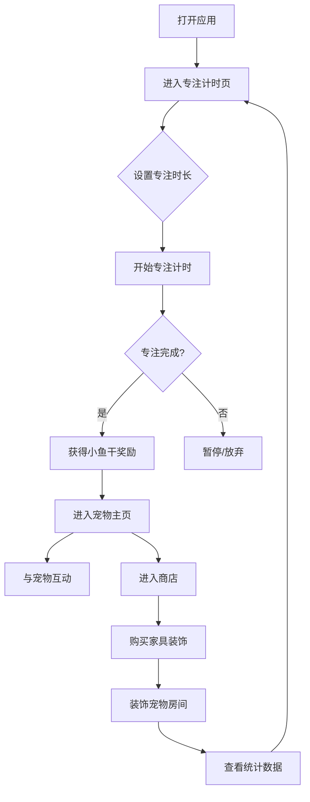

# 番茄钟宠物养成小程序 PRD

## 1. Product Overview
- 一款结合番茄工作法与宠物养成的专注类应用，帮助用户提升工作学习效率，通过可爱的电子宠物（小猫）和奖励机制增加趣味性和持续动力
- 目标是打造一个让人愿意长期使用的专注工具，通过视觉温馨、互动有趣的设计，降低用户的焦虑感，提升专注体验

## 2. Core Features

### 2.1 User Roles
| Role | Registration Method | Core Permissions |
|------|---------------------|------------------|
| 普通用户 | 本地存储（无需注册） | 使用所有核心功能，包括计时、宠物养成、商店购买 |

### 2.2 Feature Module
1. **专注计时页**：番茄钟倒计时、自定义时长、开始/暂停/重置、专注统计
2. **宠物主页**：电子宠物展示、宠物状态、互动功能、房间装饰
3. **商店页**：家具/装饰品购买、小鱼干余额展示、已购买物品管理
4. **统计页**：专注历史记录、成就系统、数据可视化

### 2.3 Page Details
| Page Name | Module Name | Feature description |
|-----------|-------------|---------------------|
| 专注计时页 | 计时器模块 | 显示当前倒计时，支持自定义时长（15-120分钟），开始/暂停/重置操作，专注完成后获得小鱼干奖励 |
| 专注计时页 | 环境音效 | 提供白噪音、雨声、森林声等背景音效选项 |
| 宠物主页 | 宠物展示 | 以手绘风格展示小猫，包含不同的表情和动画状态（睡觉、玩耍、发呆等） |
| 宠物主页 | 房间装饰 | 展示用户购买的家具和装饰品，可自由布置 |
| 商店页 | 商品列表 | 展示可购买的家具、装饰品、宠物玩具等，标注价格和效果 |
| 商店页 | 购买功能 | 使用小鱼干购买商品，购买后自动添加到背包 |
| 统计页 | 专注记录 | 展示每日/每周/每月的专注时长和完成次数 |
| 统计页 | 成就系统 | 展示已获得的成就和待解锁的成就 |

## 3. Core Process
用户主要使用流程：打开应用 → 进入专注计时页设置时长 → 开始专注 → 专注完成获得小鱼干 → 进入宠物主页互动或商店购买装饰 → 查看统计数据

## 4. User Interface Design

### 4.1 Design Style
- **主色调**：温暖的米黄色 (#F5F0E1)、深棕色 (#3D2914)、柔和的粉色 (#FFD6E0)
- **辅助色**：薄荷绿 (#A8E6CF)、天空蓝 (#B8D4E3)
- **按钮风格**：圆角矩形，轻微阴影，带有治愈系的手绘质感
- **字体**：手写风格的中文字体（如站酷快乐体），标题稍大加粗，正文清晰易读
- **布局风格**：卡片式布局，柔和的圆角，留有充足的呼吸空间
- **图标/emoji风格**：手绘风格图标，使用可爱的emoji如 🐱、🐟、⏰、🏠、🛋️

### 4.2 Page Design Overview
| Page Name | Module Name | UI Elements |
|-----------|-------------|-------------|
| 专注计时页 | 计时器模块 | 大字号倒计时显示，周围有柔和的光晕动画，背景采用图片附件中的温馨手绘风格，底部有开始/暂停/重置按钮 |
| 专注计时页 | 时长设置 | 滑动条或点击选择器，预设常用时长（25分钟、45分钟、60分钟），支持自定义输入 |
| 宠物主页 | 宠物展示 | 中央区域展示手绘风格小猫，下方是互动按钮（抚摸、喂食、玩耍），底部显示宠物心情值和饥饿值 |
| 宠物主页 | 房间装饰 | 宠物背景为温馨的小房间，可放置沙发、台灯、小桌子等家具，采用分层设计 |
| 商店页 | 商品列表 | 网格布局展示商品卡片，每个卡片包含商品图片、名称、价格、描述，顶部显示小鱼干余额 |
| 统计页 | 数据展示 | 折线图展示专注趋势，日历视图标记专注天数，成就卡片以勋章形式展示 |

### 4.3 Responsiveness
- 移动端优先设计，适配各种手机屏幕尺寸
- 触摸优化：按钮大小适中，易于点击
- 响应式布局：在平板设备上自动调整为多列布局

### 4.4 风格参考
- 参考附件图片的手绘风格，色彩温暖柔和
- 整体营造出温馨、治愈、放松的氛围
- 避免过于强烈的对比色，使用柔和的渐变和阴影
